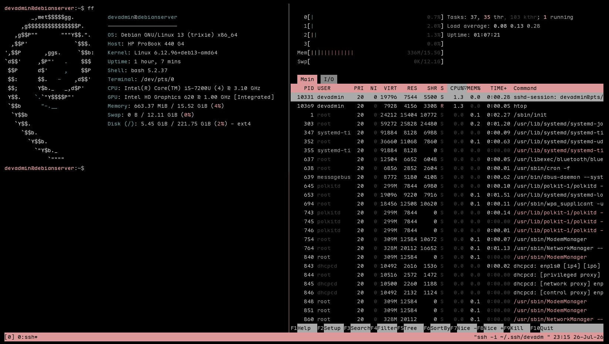

# Homelab: Debian Server with Reverse Proxy

## What this is

A self-hosted Debian server running on an old laptop, hardened from the ground up, built to learn and demonstrate real deployments, infrastructure and devops concepts.

## Server snapshot

## Components

- **Debian 13 (Trixie)** - Server Installation

## What's implemented

- SSH hardening (key-only auth, non-default port, no root login).
- Firewall `ufw` - allowing traffic only on HTTP, HTTPS and any custom application ports.
- Brute-force protection using `fail2ban`
- `nginx` reverse proxy serving a subdomain
- Docker runtime, ready for containerized services

## What's next

- Containerized service behind nginx using `docker compose`
- Monitoring
- Config driven deployments and reproducible setups

## Design decisions

See [decisions.md](decisions.md)

## Troubleshooting log

See [troubleshooting.md](troubleshooting.md)

### Steps followed to setup the server

Followed these steps [server-setup.md](server-setup.md) to configure the server on a laptop.
